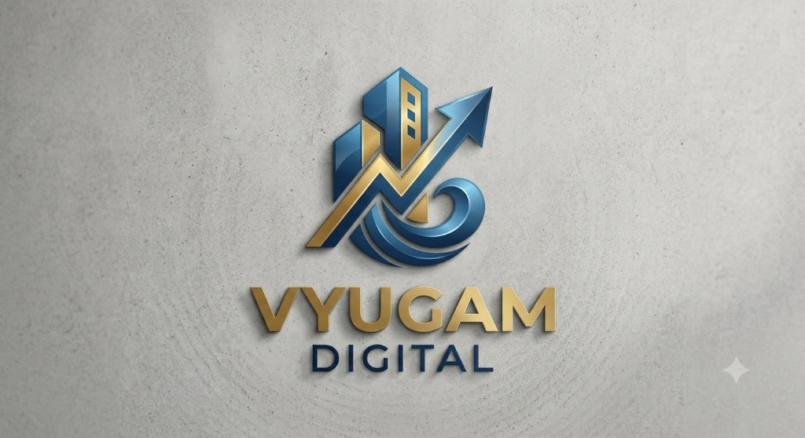

# VYUGAM - Luxury Indian Apparel Storefront

A modern, high-converting e-commerce web platform for **VYUGAM**, curated for the Indian fashion market with Men's and Women's ethnic, western, and festive collections.



## ✨ Key Features

- **Men & Women Fashion Collections**:
  - **Women**: Banarasi Silk Sarees, Handblock Mulmul Anarkali Sets, Chanderi Lehengas, Linen Dresses, Georgette Co-ords.
  - **Men**: Chanderi Silk Kurtas, Brocade Nehru Jackets, Pure Khadi Linen Shirts, Wedding Sherwanis, Chinos.
- **Indian Market Specifics**:
  - Native INR (`₹`) pricing with discount tags.
  - 6-digit Indian PIN code delivery & COD eligibility estimator (covering 19,000+ PIN codes).
  - Indian Standard Sizing Chart helper (Inches & CM).
  - WhatsApp Stylist 1-on-1 assistance.
- **Cart & Checkout**:
  - Free shipping progress bar (threshold ₹1,499).
  - Promo coupons (`FESTIVE20`, `FIRST10`, `VYUGAM500`).
  - UPI QR / UPI ID, Cash on Delivery (COD), and Card payments simulator.
  - Instant order tracking and printable receipts.

## 🚀 Tech Stack

- **Frontend**: React 18, TypeScript, Vite, Tailwind CSS
- **Icons**: Lucide React
- **Animations**: Canvas Confetti

## 📦 Getting Started

### Installation
```bash
npm install
```

### Run Development Server
```bash
npm run dev
```

### Production Build
```bash
npm run build
```

---

© 2026 VYUGAM Luxury Apparel India Pvt Ltd. Handcrafted in India.
